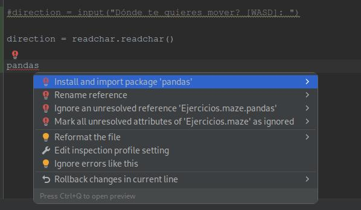

# Aprendiendo el while
Ejemplo while para validar una de las posibles opciones de un input. Primero seteamos la variable a tipo de dato None, entramos en el while y preguntamos hasta que la respuesta sea una de las opciones.
```python
#Tipo de variable none
respuesta = None

while respuesta !="A" and respuesta !="B" and respuesta !="C":
    respuesta = input("Que opción prefieres [A, B, C]")

if respuesta == "A":
    print ("Has elegido ok")
elif respuesta == "B":
    print ("Podrias haber elegido mejor")
elif respuesta == "C":
    print ("Has respuesto mal")
```
Otro ejemplo de while modificando valor variable hasta salir del loop:
```python
numero = 12
while numero > 1:
    print("Mi numero {} es mayor que 1".format(numero))
    numero -= 1

print("Mi numero es {}".format(numero))
```
---
# El combate Pokemon

>Ejercicios/[test_while_pokemon.py](https://github.com/badorius/Python_MasterMind/blob/master/Ejercicios/test_while_pokemon.py)
---
# La barra de vida

En python no existen las constantes, pero podemos utilizar variables en mayúsculas para hacer referencia a variables que no cambiaran de valor, de esta forma sabemos que sería como una constante, es como una nomenclatura.

>Ejercicios/[test_while_pokemon_nate.py](https://github.com/badorius/Python_MasterMind/blob/master/Ejercicios/test_while_pokemon_nate.py)
---
# Las listas
Las listas son un tipo de variable en python, ```python list = ["naranja", "peras", "manzanas"]``` es como una array, puede contener, número, strings, etc...
En las listas, podemos poner objetos nuevos, podemos buscar valores, buscar posiciones, que hay en la posición N, podemos unir dos listas y podemos ejecutar un código por cada uno de los objetos de nuestra lista.

Ejemplos:
```python
vocales = ["a", "e", "e", "i", "o"]
vocales.append("u") # Añadimos la u a la lista
vocales.append("l") # Añadimos la l a la lista
vocales.pop() # Borramos el ultimo elemento de la lísta
len(vocales) #Nos devuelve el número de elementos de la lista.

letra = a
letra in vocales # nos devuelve un true. Busca un valor en la lista.
```
Ejemplo not in aplicado en el while de pokemons:
```python
    while ataque_squirtle not in ['P', 'A', 'B', 'N']:
    #while ataque_squirtle != "P" and ataque_squirtle != "A" and ataque_squirtle != "B" and ataque_squirtle != "N":
        ataque_squirtle = input("Que ataque deseas realizar? [P]lacaje, Pistola [A]gua, [B]urbuja [N]ada: ")
```
Ejercicio lista de la compra.
```python
"""
Programa lista de la compra
Que deseas comprar? ([Q] para salir) > Leche
Seguro que deseas comprar "Leche"? [S/N] > S
Leche añadida a la lista de la compra.

Que deseas comprar? ([Q] para salir) > Pan
Seguro que deseas comprar "Pan"? [S/N] > N

Que deseas comprar? ([Q] para salir) > Pan
Seguro que deseas comprar "Pan"? [S/N] > S
Pan añadida a la lista de la compra.

Que deseas comprar? ([Q] para salir) > Pan
Pan ya existe en la lista de la compra.

Programa lista de la compra
Que deseas comprar? ([Q] para salir) > Q

La lista de la compra es:
["Leche", "Pan"]
"""

```
>Ejercicios/[lista_de_la_compra.py](https://github.com/badorius/Python_MasterMind/blob/master/Ejercicios/lista_de_la_compra.py)
---
**Información a comentar en la versión del curso:**
- El if con el input directamente: 
```python 
  if input("Seguro que quiere aãdir {} a la lista? [S/N]".fromat (opcion)) == "S":
```
- Cuando en una condición no queremos que se realice nada, podemos usar pass, ejemplo
```python 
  if input_usuario == "Q":
    pass
   elif input....
```
- Ejemplo de como hacer un while true y romperlo con un break tras una condición:
```python 
   while true:
    if input_de_usuario =="Q":
        break
   elif input....
```
_Importante utilizar el breakpoint/debug para ver el recorrido del if/while en caso de comportamiento diferente al esperado._
---
# Aprendiendo el for
Ejemplo for:
```python
a = [1, 2, 3, 4, 5, 6, 7, 8, 9, 10]
frase = "Hola, estoy aprendiendo python"
for item in a:
    print(item)

for letra in frase:
    print(letra)
```
>Ejercicios/[for.py](https://github.com/badorius/Python_MasterMind/blob/master/Ejercicios/for.py)

Ejemplo for con función range. Range es una función muy util para el for, la que le pasamos un número y hace un iterable de todos los números:
```python
numero_de_repeticiones = int(input("Cuantas veces quires repetir el menssaje? "))
for a in range(numero_de_repeticiones):
    print("Hola")
```
Si imprimimos un range, nos muestra un iterable, 
```python
>>> print(range(4))
range(0, 4)
```
Un range se puede convertir en una lista:
```python
>>> print(list(range(4)))
[0, 1, 2, 3]
>>>
```
Si queremos hacer un for por ejemplo que no empiece en 0, podemos hacerlo con range indicando el inicio y el fin como parámetro:
```python
>>> for i in range(1,5):
...     print(i)
... 
1
2
3
4
>>>  
```
>Ejercicios/[for_in_range.py](https://github.com/badorius/Python_MasterMind/blob/master/Ejercicios/for_in_range.py)
---
# Algunos ejercicios sencillos

2. Ejemplo

| texto_usuario                               | "Hola, me llamo Nate. Tu como te llamas? |
|---------------------------------------------|------------------------------------------|
| Output esperado                             | espacioes 6, puntos 1, comas 1           |

>Ejercicios/[for_ex1.py](https://github.com/badorius/Python_MasterMind/blob/master/Ejercicios/for_ex1.py)

2. Ejemplo
En este ejemplo utilizaremos la libreŕia string haciendo un import de esta y utilizando string.ascii_uppercase

| texto usuario    | "Hola, me llamo Nate. Tu como te llamas?  |
|------------------|-------------------------------------------|
| Output esperado  | mayusculas = 3                            |

>Ejercicios/[for_ex2.py](https://github.com/badorius/Python_MasterMind/blob/master/Ejercicios/for_ex2.py)

3. Ejemplo
Utiliizaremos la función range. Primero imprimiremos toda la tabla y después, Utilizando la operación módulo (el resto, en python %), solo sacaremos por pantalla los múltiples de 2

| Numero elegido por el usuario | 2                                          |
|-------------------------------|--------------------------------------------|
| Output esperado               | tabla de multiplicar del 2 (2 x 1 = 2 ...) |

>Ejercicios/[for_ex3.py](https://github.com/badorius/Python_MasterMind/blob/master/Ejercicios/for_ex3.py)
---
# Algunos ejercicios menos sencillos

| Numeros input usuario | [1, 2, 3, 4, 5, 6]                           |
|-----------------------|----------------------------------------------|
| Output esperado       | numero mas pequeño 1, numero más grande el 6 |

Este programa se puede hacer de varias formas, con la información que tenemos hasta ahora, una forma podría ser (atención al while en una línea con el input):
```python
#Metodo 1, Atención al while para preguntar S/N
numeros_usuario = []
numero_introducidos = input("Introduzca un número para añadir en la lista: ")
numeros_usuario.append(numero_introducidos)

while input("Desea introducir otro número [S/N]?") != "N":
    numero_introducidos = input("Introduzca un número para añadir en la lista: ")
    numeros_usuario.append(numero_introducidos)

print(numeros_usuario)
```
Otra forma de hacerlo. Como la variable del input, es un string, con el método split, podemos separar cada uno de los objetos del string separados por una "," de esta manera, podremos crear una lista de strings
De esta forma, nos tenemos que confiar que el usuario introducirá los números separados por comas, si no, no funcionará. 
Luego crearemos una tercera viarable llamada numeros_usuario_limpio ya de tipo lista, donde iremos haciendo el append pero ya con la función int, con este fin ya tendremos una lista con numeros enteros.
```python
#Metodo 2, Atención a la metodo split para romper las comas:

numero_introducidos = input("Introduzca los números separados por comas: ") #1,2,3,4,5,6
numeros_usuario = numero_introducidos.split(",")
numeros_usuario_limpio = []

for numero in numeros_usuario:
    numeros_usuario_limpio.append(int(numero))

print (numeros_usuario_limpio)
```
La tercera forma de hacerlo, es con una list comprehsion (compresion de lista) En una sola línea hacemos un for devolviendo un int del número todo entre los [] de esta forma creamos directamente una lista de enteros. 
También destacar los filtros de lista, numeros_usuario[1:] -> empieza desde el objeto 1 y no del 0, también podríamos poner [1:3] esto recorrería del 1 al 3
```python
# Metodo 3, Atención al for, list comprehesion (compresion de lista) 

numero_introducidos = input("Introduzca los números separados por comas: ") #1,2,3,4,5,6
numeros_usuario = [int(numero) for numero in numero_introducidos.split(",")]

#Steamos las variables de numero grande y pequeño con el primer valor de la lista
numero_pequenio = numeros_usuario[0]
numero_grande = numeros_usuario[0]

#Atención al numeros_usuario[1:]: --> Esto es un filtro de lista, le decimos que empiece por la posición 1 y no la 0, también podríamos poner [1:3] esto recorrería del 1 al 3
for numero in numeros_usuario[1:]:
    if numero_pequenio > numero:
        numero_pequenio = numero
    if numero_grande < numero:
        numero_grande = numero
        
print("El numero pequeño es {} y el grande {}".format(numero_pequenio, numero_grande))
```
>Ejercicios/[for_ex4.py](https://github.com/badorius/Python_MasterMind/blob/master/Ejercicios/for_ex4.py)
---
# Navegando un mapa
Realizremos un mapa y un personaje con simobolos ASCII, para ello usaremos un mapa de 20 de ancho y 15 de alto y debería quedar de la siguiente forma:
```shell
+------------------------------------------------------------+
|                                                            |
|          @                                                 |
|                                                            |
|                                                            |
|                                                            |
|                                                            |
|                                                            |
|                                                            |
|                                                            |
|                                                            |
|                                                            |
|                                                            |
|                                                            |
|                                                            |
|                                                            |
+------------------------------------------------------------+
```

El personaje se simbolizará con un @ que en un incio lo pondremos en la posición 3,1. Atención al parametro end de la llamada al print, para que no realice salto de línea después de pintar un espacio o un carácter. Ejemplo: ```python print(" @ ",end='')```
Ejemplo pintado de mapa, utilizaremos un for para las coordenadas WIDTH y otro for dentro para las coordenadas HEIGHT:
```python
POS_X = 0
POS_Y = 1
MAP_WIDTH = 20
MAP_HEIGHT = 15

my_position = [3, 1]

#my_position[POS_X]
#my_position[POS_Y]

print("+" + '-' * MAP_WIDTH * 3 + "+")

for coordinate_y in range(MAP_HEIGHT):
    print ("|",end='')
    for coordinate_x in range(MAP_WIDTH):
        if my_position[POS_X] == coordinate_x and my_position[POS_Y] == coordinate_y:
            print(" @ ",end='')
        else:
            print("   ",end='')
    print("|")

print("+" + '-' * MAP_WIDTH * 3 + "+")
```
---
# Creando movimineto interactivo
Para mover el personaje, con lo que sabemos actualmente podríamos usar un ```python direction = input("Dónde te quieres mover? [WASD]: ")``` pero esto sería un poco aburrido, ya nos pedirá un [ENTER] después de cada opción.
Para hacerlo más divertido utilizaremos la librería readchar ```python direction = readchar.readchar()``` esta librería no viene por defecto en python y la deberemos instalar, para ello podemos hacer [ALT] + [ENTER] sobre la línea maracada en rojo (ya que pycharm no encuntra dicho objeto) y le daremos a la opción de instalar el paquete readchar.
Ejemplo con la librería pandas:



printchar puede que no funcione en la consola de pycharm, lo ejecutaremos desde la consola del systema. Pero deberemos cargar el virtual environment donde estarán las librerias descargadas por pycharm ```shell source ../venv/bin/activate```, esto nos devolverá la shell con el virtual environment cargado.
Otra opción sería en pycharm, botón derecho open in terminal.

Podemos hacer una prueba añadiendo readchar al código:
```python
#direction = input("Dónde te quieres mover? [WASD]: ")

direction = readchar.readchar()
print(direction)
```
En principio este código nos imprimrá por pantalla la tecla pulsada, pero parece ser que en cmd de windows (en mi terminal no me ha sucedido) si puslamos por ejemplo la tecla f, nos devolverá por pantalla ```shell b'f'``` Esta b nos la añade porqué el readdchar nos devuelve el resultado en bytes, si queremos que nos devuelva el resultado en string, haríamos lo siguiente:
```python
#direction = input("Dónde te quieres mover? [WASD]: ")

direction = readchar.readchar().decode()
print(direction)
```
Parece ya sea por la versión de python o por la terminal, en mi caso no ha sido necesario.
Una vez apreatada la tecla deseada, solo tenemos que meter los if/elif y modificar la variable de las cordenadas:
_Atención a la opción q, al tener un while True al principio del programa, el break se utiliza para romper el while.
```python
import os
import readchar

POS_X = 0
POS_Y = 1
MAP_WIDTH = 20
MAP_HEIGHT = 15

my_position = [3, 1]
while True:
    #DRAW MAP
    #my_position[POS_X]
    #my_position[POS_Y]

    print("+" + '-' * MAP_WIDTH * 3 + "+")

    for coordinate_y in range(MAP_HEIGHT):
        print ("|",end='')
        for coordinate_x in range(MAP_WIDTH):            
            if my_position[POS_X] == coordinate_x and my_position[POS_Y] == coordinate_y:
                print(" @ ",end='')
            else:
                print("   ",end='')
        print("|")

    print("+" + '-' * MAP_WIDTH * 3 + "+")

    #direction = input("Dónde te quieres mover? [WASD]: ")
    direction = readchar.readchar()

    if direction == "w":
        my_position[POS_Y] -= 1
    if direction == "s":
        my_position[POS_Y] += 1
    if direction == "a":
        my_position[POS_X] -= 1
    if direction == "d":
        my_position[POS_X] += 1
    if direction == "q":
        #Rompemos el while True
        break

    #borramos pantalla
    if os.name == "posix":
        os.system("clear")
    elif os.name == "ce" or os.name == "nt" or os.name == "dos":
        os.system("cls")
```
---
# Aparecer de la otra parte del mapa
Para aparecer en la otra parte de la pantalla, utilizaremos la operación módulo (% el resto de una división) ya que de esta manera, si estamos en la posición 15 y nuestra pantalla mide 15, el resto nos devuelve lo que nos hemos pasado de pantalla y pero empezando por el uno
```python
>>> 16%15
1
>>>
```
En este ejemplo vemos que si la pantalla mide 15 y vamos a la 16, el resto de 1 es lo que sobra y nos viene muy bien para poner el resto como coordenada.
Aplicado al código seria:
```python
    direction = readchar.readchar()

    if direction == "w":
        my_position[POS_Y] -= 1
        my_position[POS_Y] %= MAP_HEIGHT
    if direction == "s":
        my_position[POS_Y] += 1
        my_position[POS_Y] %= MAP_HEIGHT
    if direction == "a":
        my_position[POS_X] -= 1
        my_position[POS_X] %= MAP_WIDTH
    if direction == "d":
        my_position[POS_X] += 1
        my_position[POS_X] %= MAP_WIDTH
    if direction == "q":
        break
```
El módulo funcionaría tanto en negativo como en positivo, ya que si por ejemplo hacemos -1 % 15, nos enviaría a la posición 14 que sería el resto.

---
# Colocando los cebos
En este apartado vamos a poner objetos por el mapa. Estos objetos van estar dentro de una lista de objetos, que a su vez estará formada por otras listas dentro, que van a tener las cordenadas de los objetos.
```python
map_objects = [[2, 3], [5, 4], [3, 4], [10, 6]]
```
Con esto ahora deberemos chquear cada vez que nos movemos, si estamos pasando por la cooredenada que tiene uno de los objetos.
Si estamos en una posición que no hay objeto, no pasará nada, si estamos en la posición donde hay un objeto, borraremos dicho objeto. Esto lo aremos con la variable object_in_cell

Para dibujar los objetos, haremos la modificación en la parte del código donde dibujamos el mapa, dentro de if, evaularemos si estemos en la coordenado del personaje pintaremos un @, si estamos en la coordenada del objeto, pintaremos un *, si no, pintaremos un espacio en blanco, para ello utilizaremos la variable char_to_draw:
```python
    #DRAW MAP
    print("+" + '-' * MAP_WIDTH * 3 + "+")

    for coordinate_y in range(MAP_HEIGHT):
        print ("|", end='')
        for coordinate_x in range(MAP_WIDTH):
            char_to_draw = " "

            for map_object in map_objects:
                if map_object[POS_X] == coordinate_x and map_object[POS_Y] == coordinate_y:
                    char_to_draw = "*"

            if my_position[POS_X] == coordinate_x and my_position[POS_Y] == coordinate_y:
                char_to_draw = "@"

            print(" {} ".format(char_to_draw), end="")
        print("|")

    print("+" + '-' * MAP_WIDTH * 3 + "+")
```
Para borrar los objects cuando pasamos por encima de ellos, borraremos el objeto de la lista cuando pasemos por esa coordenadada. Por ejemplo, si tenemos una ```python lista a = ["a", "b", "c"]``` y luego hacemos ```python a.remove("c")``` borraríamos el objecto c de la lista.
En el código del programa quedaría de tal forma:

```python
while True:
    #my_position[POS_X]
    #my_position[POS_Y]

    #DRAW MAP
    print("+" + '-' * MAP_WIDTH * 3 + "+")

    for coordinate_y in range(MAP_HEIGHT):
        print ("|", end='')
        for coordinate_x in range(MAP_WIDTH):
            char_to_draw = " "
            #Unset object_in_cell var for each redraw.
            object_in_cell = None

            for map_object in map_objects:
                if map_object[POS_X] == coordinate_x and map_object[POS_Y] == coordinate_y:
                    char_to_draw = "*"
                    #We are on object possition, so we set object_in_cell var with coordenate value do delete object from list
                    object_in_cell = map_object

            if my_position[POS_X] == coordinate_x and my_position[POS_Y] == coordinate_y:
                char_to_draw = "@"

                # If var object_in_cell is not None, we have to remove coordenate value from list:
                if object_in_cell:
                    map_objects.remove(object_in_cell)

            print(" {} ".format(char_to_draw), end="")
        print("|")

    print("+" + '-' * MAP_WIDTH * 3 + "+")
```
---
# SNAKE!
Primer reto será modificar la lista de objecto para que contenga 10 objetos y aparezcan en un lugar aleatorio, para ello modificaremos la variable de tal forma:
```python
NUM_OF_MAP_OBJECTS = 11

my_position = [3, 1]
map_objects = []

# Generate random objects on the map
while len(map_objects) < NUM_OF_MAP_OBJECTS:
    new_position = [random.randint(0, MAP_WIDTH), random.randint(0, MAP_HEIGHT)]

    if new_position not in map_objects and new_position != my_position:
        map_objects.append(new_position)
```
Ahora vamos a crear la variable ```python tail_lenght``` para hacer que la cola de nuestro personaje crezca cada vez que come un objeto (snake)
Primer debemos aumentar el valor de esta variable cada vez que estamos en la celda del objecto:
```python
                # If var object_in_cell is not None, we have to remove coordenate value from list:
                if object_in_cell:
                    map_objects.remove(object_in_cell)
                    tail_lenght += 1
```
Luego necesitamos printar la cola que va ser una lista llamada ```python tail``` cada vez que estemos en la celda del objecto haremos un append a la lista con la posición
Deberemos modificar valores en la parte del código de draw map y en la parte del movimiento, necesitamos poner en la cola nuestras últimas posiciones (.insert es como un append para las listas):
```python
    if direction == "w":
        tail.insert(0, my_position.copy())
        my_position[POS_Y] -= 1
        my_position[POS_Y] %= MAP_HEIGHT
    if direction == "s":
        tail.insert(0, my_position.copy())
        my_position[POS_Y] += 1
        my_position[POS_Y] %= MAP_HEIGHT
    if direction == "a":
        tail.insert(0, my_position.copy())
        my_position[POS_X] -= 1
        my_position[POS_X] %= MAP_WIDTH
    if direction == "d":
        tail.insert(0, my_position.copy())
        my_position[POS_X] += 1
        my_position[POS_X] %= MAP_WIDTH
    if direction == "q":
        break
```
El ```python .copy``` lo utilizamos ya que hemos visto que si no ponemos el copy, está guardando todo el rato la reerencia y no la copia, para insertamos la copia.

Para pintar la cola por donde vamos pasando necesitamos este for dentro del draw:
```python
            # We draw all tail lenght with for
            for tail_piece in tail:
                if tail_piece[POS_X] == coordinate_x and tail_piece[POS_Y] == coordinate_y:
                    char_to_draw = "@"
```

De esta forma, nos dibuja una cola infinitamente larga, para que esto no suceda, utilizaremos el ```python tail = tail[:tail_lenght]```
Como vamos sumando +=1 a la variable tail lenght, cada vez que coincide con un objeto, esto nos hará el efecto de la cola.

```python
    #direction = input("Dónde te quieres mover? [WASD]: ")
    direction = readchar.readchar()

    if direction == "w":
        tail.insert(0, my_position.copy())
        tail = tail[:tail_lenght]
        my_position[POS_Y] -= 1
        my_position[POS_Y] %= MAP_HEIGHT
    if direction == "s":
        tail.insert(0, my_position.copy())
        tail = tail[:tail_lenght]
        my_position[POS_Y] += 1
        my_position[POS_Y] %= MAP_HEIGHT
    if direction == "a":
        tail.insert(0, my_position.copy())
        tail = tail[:tail_lenght]
        my_position[POS_X] -= 1
        my_position[POS_X] %= MAP_WIDTH
    if direction == "d":
        tail.insert(0, my_position.copy())
        tail = tail[:tail_lenght]
        my_position[POS_X] += 1
        my_position[POS_X] %= MAP_WIDTH
    if direction == "q":
        break
```
---
# Snake muere :(