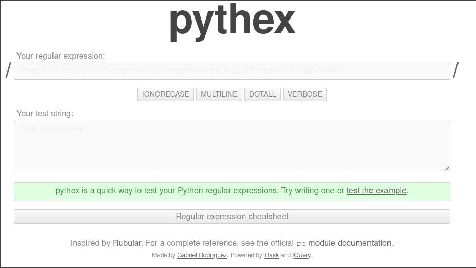

# Esto son funciones
Programación imperativa es aquella en la que se seguiran las instrucciones línea a línea, sin poder volver atrás.
Las funciones nos servirán para guardar una secuencia de código bajo un nombre para poder ejecutarlas haciendo referencia a ese nombre en cualquier momento.

Ejemplo básico función:
```python
def saludo_secreto():
    print("Hola Mundo")

    a = input("Cómo estás?")
    b = input("Dos más dos?")

    if b == "2":
        print("Tu si que sabes...")

saludo_secreto()
```
>**NOTA:**
Entre funciones y código main, deben existir 2 líneas como mínimo.
Cuando llamamos a la función lo hacemos con saludo_secreto(), si no ponemos los paréntesis, estamos haciendo referencia al objecto, no llamando a la función, ya que en python las funciones son objetos. 

En python todo son objetos. Podríamos hacer un print del objeto/función, ejemplo y nos mostraría la dirección de memorial:
```python
print(saludo_secreto)
<function saludo_secreto at 0x7f4e2e167d90>
```

Ejemplo pasar argumentos a las funciones:
```python
def saludo_sectario(nombre):
    print("Hola {}".format(nombre[::-1]))

saludo_sectario("nataS")
saludo_sectario("reficuL")
saludo_sectario("htiliL")
saludo_sectario("ratS gninroM")
```
>**Nota: 
Para darle la vuelta a un string, hemos utilizado nombre[::-1], lo veremos con más detalle.**

Ejemplo devolver argumento función con return:
```python
def largo_string(mi_string):
    largo = 0
    for n in mi_string:
        largo += 1
    return largo

largo_de_la_string = largo_string("Hola mundo")
print(largo_de_la_string)
```
>Nota:
return siempre es el fin de la función, pararía la función, si ponemos solo return la función finalizaría, si ponemos return $VARIABLE, la función finalizará devolviendo el valor de la variable.
Las variables que están dentro de la función, se eliminan automáticamente una vez finalizada la función. Podríamos decir que la función, es su un programa con sus variables y sus estados, todo lo que ocurra dentro se elimina una vez finaliza la función.

Python ya tiene built in functions, podemos dar un vistazo en:
[https://docs.python.org/3/library/functions.html](https://docs.python.org/3/library/functions.html)

Realmente, abrir un archivo en python y empezar a escribir todo el código entero en el, no es el concepto correcto de python. A partir de ahora, la estructura que utilizaremos será como la del siguiente ejemplo:
```python
def main():
    print("Hola mundo")

if __name__ == "__main__":
    main()
```
Programaremos todo dentro de main, programación funcional.

**Ejerecicios "Esto son funciones"**

Usando la nueva estructura de programas basado en la función main() y la condición if final, crea un programa de cualquier tipo. Lo que te de la gana. Usa el debugger para ver como se produce el hilo de ejecución del código.
[Ejercicio 1](https://github.com/badorius/curso-python/blob/master/Ejercicios/modulo_funciones/Ejercicio1.py)

Crea un programa que contenga una función que calcule la potencia de un numero introducido como argumento, por ejemplo:
[Ejercicio 2](https://github.com/badorius/curso-python/blob/master/Ejercicios/modulo_funciones/Ejercicio2.py)

---
# Experimentos
Cuando definimos una funcion y no queremos que en esta se ejecute nada, lo haremos con pass:
```python
def main():
    pass
```
Ejemplo de recursividad:
Funciones que llaman a otra funcion dentro de un bucle:
```python
from time import sleep

def c():
    print("c")
    sleep(1)
    a()

def b():
    print("b")
    sleep(1)
    c()

def a():
    print("a")
    sleep(1)
    b()

def main():
    a()

if __name__ == "__main__":
    main()
```
Ejemplo recursividad 2: 
```python
from time import sleep

def sumar_uno(a):
    print (a)
    a += 1
    if a  != 100:
        sumar_uno(a)

def main():
    sumar_uno(1)

if __name__ == "__main__":
    main()
```

La recursividad tiene sus usos, como por ejemplo en la Secuencia de [fibonacci](https://es.wikipedia.org/wiki/Sucesi%C3%B3n_de_Fibonacci) en la que en una sequencia de numeros, cada numero se suma con el anterior.
0,1,1,2,3,5,8,13,21,34,55,89,144,233,377,610,987,1597

Ejemplo recursividad fibonacci:
```python
from time import sleep
MAX_NUM = 30000000

def sumar_uno(a, b):
    next_num = a + b
    print("{}, ".format(next_num),end ="")
    a = b
    b = next_num
    if next_num<= MAX_NUM:
        sumar_uno(a, b)

def main():
    a = 0
    b = 1
    sumar_uno(a, b)

if __name__ == "__main__":
    main()
```
[https://github.com/badorius/curso-python/blob/master/Ejercicios/modulo_funciones/fibonaccy.py](https://github.com/badorius/curso-python/blob/master/Ejercicios/modulo_funciones/fibonacci.py)

Multiples argumentos funcionales. A las funciones les podemos pasar un número indefinido de argumentos, un ejemplo:
```python
from time import sleep

def medir_largos(iterable, *args):
    if args:
        largos=[len(iterable)]
        for a in args:
            largos.append(len(a))
        return largos
    return len(iterable)


def main():
    print(medir_largos("hola"))
    print(medir_largos("hola", "como", "estas"))

if __name__ == "__main__":
    main()
```
[https://github.com/badorius/curso-python/blob/master/Ejercicios/modulo_funciones/args.py](https://github.com/badorius/curso-python/blob/master/Ejercicios/modulo_funciones/args.py)

>Notas:
Iterable es un conjunto de datos que se pueden recorrer con un for, por ejemplo una lista, una tupla.
Cuando llamamos a la function medir_largos, podemos pasar tantos argumentos como queramos, estos seran recibidos por la function con *args que seran convertidos a tupla.
Una tupla es como una lista, pero no se puede modificar, no tiene funciones para ordenar, buscar, appends, etc..., es inmutables, es como una version reducida de la lista.
Las tuplas se usan especialmente en python, porque ocupan menos memoria que las listas.


Podemos crear funciones dentro de funciones, estas solo podran ser llamadas desde la funcion donde se han creado, no desde una tercera funcion, lo que pasa en las vegas, se queda en las vegas. Todo lo que hay definido en una funcion solo existe en la funcion.
Ejemplo:
```python
def medir_largos(iterable, *args):
    def sumar(num1, num2):
        return num1 + num2
    
    Print("Total suma:", sumar(1, 2))
```
>Notas
La funcion sumar solo se puede llamar desde la propia funcion medir_largos

Otra cosa que podemos pasar a las funciones son atributos opcionales. Al definir la funcion, podemos crear estos argumentos con su valor default, que si cuando se hace la llamada a la funcion no son pasados, entraran en la funcion con su valor por defecto, o de lo contrario, cuando llamamos a la funcion pasamos este argumento con su valor, la funcion cogera el valor de la llamda. 
Ejemplo:
```python
def medir_largos(iterable, *args, sumar_todo=False):
    ...
    ...
    if sumar_todo:
        largos=sum(largos)

def main():
    print(medir_largos("hola", "como", sumar_todo=True))
```
>Nota:
La funcion sum() es propia de python.

Como ejercicio, hay que hacer un programa con una funcion que calcule una potencia de un número que se le pasa por parametro, por defecto si no se pasa el segundo parametro será el número del primer parametro elevado a 2, si se pasan los dos paramentros sera el numero elevado al segundo parametro.

[https://github.com/badorius/curso-python/blob/master/Ejercicios/modulo_funciones/potencia.py](https://github.com/badorius/curso-python/blob/master/Ejercicios/modulo_funciones/potencia.py)

---
# Un par de ejercicios menos rápido

[https://github.com/badorius/curso-python/blob/master/Ejercicios/modulo_funciones/fibonaccy.py](https://github.com/badorius/curso-python/blob/master/Ejercicios/modulo_funciones/fibonacci.py)

[https://github.com/badorius/curso-python/blob/master/Ejercicios/modulo_funciones/potencia.py](https://github.com/badorius/curso-python/blob/master/Ejercicios/modulo_funciones/potencia.py)

---
# La clase más aburrida de este módulo

Ejercicio 1: La string más larga
Crea una funcion que reciba una lista de strings como entrada y te diga cual es la más larga de todas

Ejemplo:
```shell
string_mas_larga("hola", "como", "estas")

> "estas"
```
[https://github.com/badorius/curso-python/blob/master/Ejercicios/modulo_funciones/string_mas_larga.py](https://github.com/badorius/curso-python/blob/master/Ejercicios/modulo_funciones/string_mas_larga.py)

Ejercicio 2: Sumando la lista
Crea una función que sume una lista de números, no se vale usar la función sum()

Ejemplo:
```shell
suma([1, 2, 3, 4, 5])

> 15
```

[https://github.com/badorius/curso-python/blob/master/Ejercicios/modulo_funciones/sumando_una_lista.py](https://github.com/badorius/curso-python/blob/master/Ejercicios/modulo_funciones/sumando_una_lista.py)

Ejercicio 3: Par o impar
Crea una función que te de True como resultado si el número pasado como argumento es impar

Ejemplo:
```shell
es_impar(3)

> True

es_impar(24)

> False
```

[https://github.com/badorius/curso-python/blob/master/Ejercicios/modulo_funciones/par_o_impar.py](https://github.com/badorius/curso-python/blob/master/Ejercicios/modulo_funciones/par_o_impar.py)

Ejercicio 4: Pregunta algo
Crea una función que pregunte al usuario si esta seguro o no, y devuelva los valores "True" o "False" dependiendo de si el usuario está seguro.

[https://github.com/badorius/curso-python/blob/master/Ejercicios/modulo_funciones/estas_seguro.py](https://github.com/badorius/curso-python/blob/master/Ejercicios/modulo_funciones/estas_seguro.py)

Ejercicio 5: A mayus

Crea una función que convierta toda una string en mayusculas, no vale usar el método upper()

[https://github.com/badorius/curso-python/blob/master/Ejercicios/modulo_funciones/mayus.py](https://github.com/badorius/curso-python/blob/master/Ejercicios/modulo_funciones/mayus.py)

Ejercicio 6: Adivina el número

Crea una función que reciba como argumento un número del 1 al 100 a adivinar y que le pregunte al usuario que adivine el número. El código se ejecutará hasta que el usuario adivine.

[https://github.com/badorius/curso-python/blob/master/Ejercicios/modulo_funciones/adivina_numero.py](https://github.com/badorius/curso-python/blob/master/Ejercicios/modulo_funciones/adivina_numero.py)

Ejercicio 7: Lista de la compra

Crea una función que dada una lista de la compra definida fuera de la función, permita al usuario añadir un nuevo item asegurandose que no exista anteriormente en la lista.

[https://github.com/badorius/curso-python/blob/master/Ejercicios/modulo_funciones/lista_compra.py](https://github.com/badorius/curso-python/blob/master/Ejercicios/modulo_funciones/lista_compra.py)

---

# Compras funcionales

En el próximo ejercicio veremos como escribir en un fichero de texto con open. Destacar que cuando abrimos el fichero, lo podemos abrir en modo lectura (r), escritura (w), append (a), este último lo utilizaríamos para no borrar el contenido ya existente, como un >> vs a un >
Finalmente cerramos el fichero:
```python
    a = open("compra.txt", "w")
    a.write("\n".join(lista_compra))
    a.close()
```

Ejemplo lista de la compra escribiendo en un fichero de sistema:

[https://github.com/badorius/curso-python/blob/master/Ejercicios/modulo_funciones/lectura_escritura.py](https://github.com/badorius/curso-python/blob/master/Ejercicios/modulo_funciones/lectura_escritura.py)

---

# Ahora tú:

Ejercicio 1: Externalizar guardado
Mueve el código de guardar el archivo a una función externa

Ejercicio 2: Lista de productos fija
De ahora en adelante el usuario solo podrá introducir los productos que estén en una lista especifica. Por ejemplo si nuestra lista tiene "Pan", "Pollo" y "Pipas", el usuario solo podrá meter en la lista de la compra uno de esos 3 items.
Lo haremos comprobando que el texto introducido por el usuario está en la lista de productos preestablecidos. Si no lo está le daremos un mensaje avisándole que ese producto no está disponible para meter en la lista.

Ejercicio 3: Mostrar la lista
Implementa el comando "LISTA" para ver los items disponibles que se pueden añadir a la lista, así el usuario sabe que puede meter en su lista de la compra y que no.

Notas de los ejercicios:
- En python podemos abreviar el abrir y cerrar ficheros de la siguiente forma:
```python
    with open(nombre_fichero + ".txt", "w") as mi_archivo:
        mi_archivo.write("\n".join(lista_compra))
```
Con esto abrimos, escribimos y cerramos el fichero.

- Para convertir una variable en minúsculas, lo hacemos con .lower:
```python
while item_elegido.lower() not in items_del_supermercado and item_elegido != SALIDA: 
```


[https://github.com/badorius/curso-python/blob/master/Ejercicios/modulo_funciones/lectura_escritura_ejercicio_1_2_3.py](https://github.com/badorius/curso-python/blob/master/Ejercicios/modulo_funciones/lectura_escritura_ejercicio_1_2_3.py)

---

# Trabajando con listas y funciones 
Notas importantes del ejercicio:
- Volveremos a convertir el input del usuario a lower con ```input_usuario.lower()```
- también convertiremos la lista en minúsculas con un for de la siguiente forma: 
```python
[a.lower() for a in lista_compra]
```
Sería equivalente a:
```python
segunda_lista = []
for a in lista_compra:
    segunda_lista.append(a.lower())
```
- Cuando pasamos una variable o un valor a una función, ese valor solo existe en la función, si se altera en la función deberíamos hacer un return para que main tenga el valor alterado, pero con las listas por ejemplo, no és necesario ya que cuando pasamos una lista a una función, python realmente le pasa el punto de memória a la lista, con lo que si altera algún valor, lo hace directamente sobre la dirección de memória donde está lista, con lo que no hay que devolver la lista, ya ha quedado alterada desde la función al trabajar directamente con el puntero de memória.
- 
[https://github.com/badorius/curso-python/blob/master/Ejercicios/modulo_funciones/lectura_escritura_listas_y_funciones.py](https://github.com/badorius/curso-python/blob/master/Ejercicios/modulo_funciones/lectura_escritura_listas_y_funciones.py)

---

# Gestionando excepciones
Notas del ejercicio:
- Cargamos el fichero anterior en una lista, pero para que no introduzca una sola string, utilizamos el split para que nos cambie los espacioes por new lines:
```python
lista_compra = a.read().split("\n")
```
En el ejercicio debemos comprobar si el fichero a cargar de lista existe, ya que no si no existe, el programa dará error, en este caso debemos controlar este error con:
```python
    if input("Quieres cargar la última lista de la compra? [S/N]") == "S":
        try:
            with open(ARCHIVO_LISTA, "r") as a:
                lista_compra = a.read().split("\n")
        except FileNotFoundError:
            print("Archivo de la compra no encontrado!")
```
En este caso indicamos el tipo de excepcion ```FileNotFoundError```, podriamos poner sencillamente ```Exception``` pero no seria tan limpio.


[https://github.com/badorius/curso-python/blob/master/Ejercicios/modulo_funciones/lectura_escritura_excepciones.py](https://github.com/badorius/curso-python/blob/master/Ejercicios/modulo_funciones/lectura_escritura_excepciones.py)

---

# H4X0RRSCRIPT

Vamos a crear un fichero en el escritorio del OS utilizando la librería os function os.getlogin() y asi conseguir el login id:

Ejemplo fichero de texto:
[https://github.com/badorius/curso-python/blob/master/Ejercicios/modulo_funciones/hackerscript.py](https://github.com/badorius/curso-python/blob/master/Ejercicios/modulo_funciones/hackerscript.py)

Ejemplo fichero binario aleatorio:
[https://github.com/badorius/curso-python/blob/master/Ejercicios/modulo_funciones/hackerscript.py](https://github.com/badorius/curso-python/blob/master/Ejercicios/modulo_funciones/hackerscript.py)


---

# H4X0RRSCRIPT - Espiando el historial de Google Chrome

[https://github.com/badorius/curso-python/blob/master/Ejercicios/modulo_funciones/hackerscript_history_chrome.py](https://github.com/badorius/curso-python/blob/master/Ejercicios/modulo_funciones/hackerscript_history_chrome.py)

En este ejercicio importaremos las siguientes librerias:
- import os -> Para gestionar ficheros del OS
- from time import sleep -> Dejar sleeps en while
- from random import randrange -> buscar un numero de horas o segundos aleatorio para ejectuar el script
- from pathlib import Path -> Buscaremos el home del usuario con Path.home
- import sqlite3 -> Lanzaremos consultas sql al fichero de historial del chrome.

La parte de codigo donde realizamos la conexon sqlite:
```python
            connection = sqlite3.connect(history_path)
            cursor = connection.cursor() # Establece el objecto de conexion
            cursor.execute("SELECT title, last_visit_time, url FROM urls ORDER BY last_visit_time DESC")
            urls = cursor.fetchall() # Hacemos un fetch del resultado de la consulta guardando este en una variable
            connection.close()
```

---

# H4X0RRSCRIPT - Regex y sus usos para el mal
Con el fin de filtrar las urls deseadas (por ejemplo las de twitter) utilizaremos las regular expresions, 
En [https://pythex.org/](https://pythex.org/) encontraremos un tester de regular expressions. 

En el siguiente ejemplo buscamos con una expresión regular, la string https://twitter.com/[A-Za-z0-9]+$ en el texto https://twitter.com/nategentile7 y nos muestra el resultado:



Con la siguiente expresión regular ```[A-Za-z0-9]+$``` buscamos cualquier caracter mayúsculas A-Z, cualquier caracter minúsculas a-z y cualquier número 0-9 y con el + al final le indicamos que tiene que haber 1 o más de 1, así buscará estos en todo el texto hasta el final, con el $ indicamos que finaliza la búsqueda, o sea a la que aparezca un carácter diferente a los indicados, por ejemplo / finaliza.

En python existe una librería para las regular expression, para poder hacer uso de la librería la deberemos importar con :

```python
import re
```

Para buscar con una expressión regular en un texto, utilizaremos re.findall el que necesita dos parámetros, 1 la expresión regular y 2 el texto:
 ```python
re.findall("https://twitter.com/[A-Za-z0-9]+$", item[2])
```

Ahora vamos a guardar el resultado en una variable que si tiene valor, retornará la función:
```python
    for item in chrome_history:
        results = re.findall("https://twitter.com/([A-Za-z0-9]+)$", item[2])
        if results:
            print(results[0])
```

Para que nos devuleva solo el nombre del perfil sin el "https://twitter.com/" capturaremos el string que buscamos con (), con lo que cambiaremos "https://twitter.com/[A-Za-z0-9]+$" por "https://twitter.com/([A-Za-z0-9])+$"

Ahora nos muestra solo el string del perfil tal y como queríamos:
```shell
Durmiendo 3 Segundos...
home
notifications
explore
login
nineinchnails
nategentile7

Process finished with exit code 0
```

Pero como podemos ver, tenemos algunos valores que no son perfiles, como home, notifications, etc... para ello lo haremos de la siguiente forma::

```python
def check_history_and_scare_user(hacker_file, chrome_history):
    maxhist = 1
    profiles_visited = []
    url_exceptions = ["home", "notifications", "explore", "login"]

    for item in chrome_history:
        results = re.findall("https://twitter.com/([A-Za-z0-9]+)$", item[2])
        if results and results[0] not in url_exceptions:
            profiles_visited.append(results[0])
    hacker_file.write("He visto que has estado husmeando en los perfiles de {}...".format(", ".join(profiles_visited)))
```

Ejercicio completo twitter:

[https://github.com/badorius/curso-python/blob/master/Ejercicios/modulo_funciones/hackerscript_history_Regex.py](https://github.com/badorius/curso-python/blob/master/Ejercicios/modulo_funciones/hackerscript_history_Regex.py)

Ejercicio completo funciones facebook, youtube, tiwtter:

[https://github.com/badorius/curso-python/blob/master/Ejercicios/modulo_funciones/hackerscript_history_twitter_youtube_facebook.py](https://github.com/badorius/curso-python/blob/master/Ejercicios/modulo_funciones/hackerscript_history_twitter_youtube_facebook.py)

---
# H4X0RRSCRIPT - Se en que banco tienes tu dinero...

