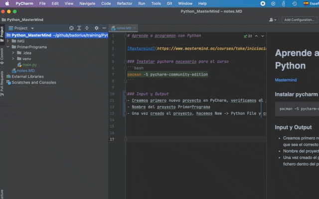
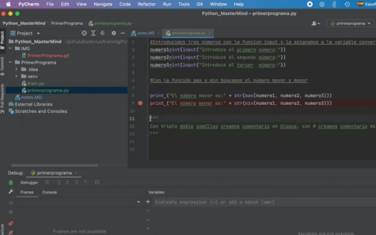

# Aprende a programan con Python

[Mastermind](https://www.mastermind.ac/courses/take/iniciacion-python)

### Instalar pycharm necesario para el curso 
```bash
pacman -S pycharm-community-edition
```

### Input y Output
- Creamos primero nuevo proyecto en PyCharm, verificamos el interprete que sea el correcto en settings.
- Nombre del proyecto PrimerPrograma
- Una vez creado el proyecto, hacemos New -> Python File y creamos un fichero dentro del proyecto llamado primerprograma.py



Haciendo click justo al lado de una línea, creamos un breakpoint, de esta manera al ejecutar en modo debug, podemos ir viendo toda la información saltando paso a paso.



Ahora crearemos nuestro primero programa en el directorio PrimerPrograma donde buscaremos el número mayor y menor entre tres números entrados por el usuario con las siguientes funciones:

``` 
#Introducimos tres números con la funcion input y la asignamos a la variable convertiendo esta de tipo int
numero1=int(input("Introduce el primero número:"))
numero2=int(input("Introduce el segundo número:"))
numero3=int(input("Introduce el tercer  número:"))

#Con la función max y min búscamos el número mayor y menor

print ("El número mayor es:" + str(max(numero1, numero2, numero3)))
print ("El número menor es:" + str(min(numero1, numero2, numero3)))

"""
Con triple doble comillas creamos comentario en bloque, con # creamos comentario de línea
"""
```
*Encontraremos este programa en PrimerPrograma/primerprograma.py*

__**Corrigiendo tu primer programa**__


